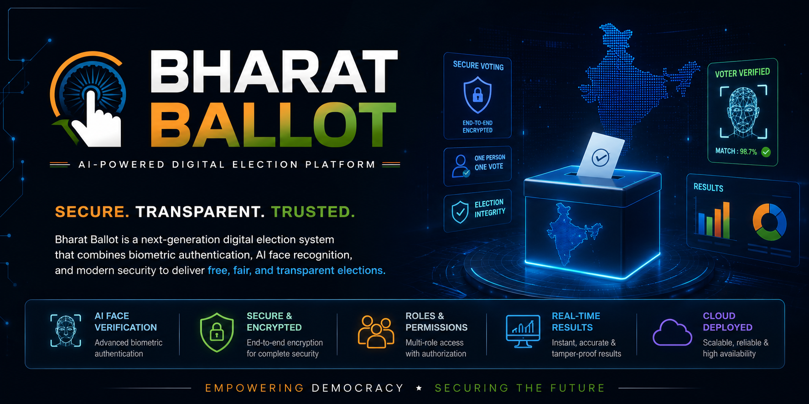

<p align="center">
  
</p>

<h1 align="center">🗳️ Bharat Ballot</h1>

<h3 align="center">
AI-Powered Digital Election Management Platform
</h3>

<p align="center">
Building a Secure, Transparent & Scalable Future for Democratic Elections 🇮🇳
</p>

---

<p align="center">


</p>

---

<p align="center">

<a href="https://adminrawjet.onrender.com">

</a>

<a href="https://voterrawjet.onrender.com">

</a>

</p>

---

# 🇮🇳 Reimagining Democratic Elections

Bharat Ballot is a **next-generation AI-powered digital election management platform** designed to modernize the election process while preserving the integrity, transparency, and security expected from democratic institutions.

Unlike conventional online voting systems that primarily digitize paper workflows, Bharat Ballot introduces **biometric identity verification, constituency-aware administration, election lifecycle management, and role-based governance** into a unified platform.

The project has been architected as a **multi-service distributed application**, consisting of independent frontends for election administrators and citizens, a centralized REST API server, and an AI-powered biometric verification service.

Whether conducting **Lok Sabha**, **State Assembly**, **Municipal**, or **Panchayat** elections, Bharat Ballot provides an extensible infrastructure capable of managing the complete electoral lifecycle—from voter registration to result publication.

---

# 🎯 Vision

To create a secure, transparent, and technology-driven electoral ecosystem that enhances public trust by combining modern software engineering with artificial intelligence and robust authentication mechanisms.

---

# ❓ Why Bharat Ballot?

Traditional election systems often face several challenges:

- Manual administrative overhead
- Identity verification issues
- Human errors
- Long processing times
- Lack of transparency
- Inefficient voter management
- High operational costs

Bharat Ballot addresses these challenges through an integrated digital platform that automates election administration while ensuring that every vote is cast securely and counted accurately.

---

# 🌟 Key Highlights

<table>
<tr>
<td width="50%">

### 🗳 Election Management

- Multiple Election Types
- Election Lifecycle Automation
- Election Scheduling
- Result Publication
- Status Synchronization

</td>

<td width="50%">

### 👥 User Management

- Head Portal
- Admin Portal
- Citizen Portal
- Role Based Access
- Constituency Assignment

</td>
</tr>

<tr>
<td>

### 🤖 Artificial Intelligence

- Face Enrollment
- Face Verification
- InsightFace Recognition
- Embedding Generation
- Cosine Similarity Matching

</td>

<td>

### 🔐 Security

- JWT Authentication
- Password Hashing
- Protected APIs
- Duplicate Vote Prevention
- One Person • One Vote

</td>
</tr>
</table>

---

# 🚀 Project Highlights

✅ AI Powered Face Verification

✅ Multi-Role Authentication

✅ Separate Admin & Citizen Portals

✅ Face Verification Before Voting

✅ Constituency Based Administration

✅ Automated Election Status Management

✅ Cloud Image Storage

✅ RESTful API Architecture

✅ MongoDB Atlas Database

✅ Secure JWT Authentication

✅ Responsive Modern User Interface

✅ Production Deployment on Render

---

# 🏛 Supported Election Types

| Election | Status |
|-----------|---------|
| 🇮🇳 Lok Sabha | ✅ |
| 🏛 State Assembly | ✅ |
| 🏙 Municipal Corporation | ✅ |
| 🌾 Panchayat | ✅ |

---

# 👥 System Roles

## 🧑‍💼 Head

The Head acts as the Election Commissioner of the platform.

Responsibilities include:

- Creating elections
- Managing election lifecycle
- Managing administrators
- Monitoring elections
- Publishing official results
- System-wide supervision

---

## 👨‍💼 Administrator

Each administrator is assigned to specific constituencies and operates only within their authorized jurisdiction.

Responsibilities include:

- Candidate Management
- Voter Registration
- Candidate Verification
- Voter Verification
- Constituency Administration
- Election Monitoring

---

## 🧑 Citizen (Voter)

Every registered voter has a secure portal for participating in elections.

Capabilities include:

- Secure Login
- Face Verification
- View Candidates
- Cast Vote
- View Election Results
- One-Time Voting Enforcement

---

# 🏗 High-Level System Architecture

```text
                           Bharat Ballot

             ┌──────────────────────────────────────┐
             │          React Frontends             │
             │                                      │
             │  Head Portal   Admin Portal   Voter  │
             └───────────────────┬──────────────────┘
                                 │
                                 ▼
                    Express.js REST API Server
                                 │
             ┌───────────────────┴──────────────────┐
             ▼                                      ▼
      MongoDB Atlas                     Python AI Service
             │                                      │
             │                               InsightFace
             │                                      │
             └───────────────┬──────────────────────┘
                             ▼
                     Secure Digital Elections
```

---

# ⚡ Core Modules

The Bharat Ballot platform is organized into independent modules that together provide a complete election ecosystem.

| Module | Description |
|----------|-------------|
| 🗳 Election Management | Create, schedule, activate and archive elections |
| 👥 User Management | Manage Heads, Admins and Voters |
| 🏛 Constituency Management | Support for Lok Sabha, Assembly, Municipal and Panchayat constituencies |
| 🎯 Candidate Management | Register, update and manage election candidates |
| 🤖 AI Face Recognition | Biometric enrollment and verification using InsightFace |
| 🔐 Authentication | JWT based secure authentication with role-based authorization |
| 📊 Result Management | Automatic result publication and visualization |
| ☁ Cloud Integration | Cloudinary image storage and Render deployment |

---

# 📈 Current Project Status

| Module | Progress |
|----------|----------|
| Authentication | ✅ Complete |
| Election Management | ✅ Complete |
| Candidate Management | ✅ Complete |
| Voter Management | ✅ Complete |
| Constituency Management | ✅ Complete |
| Face Enrollment | ✅ Complete |
| Face Verification | ✅ Complete |
| Secure Voting | ✅ Complete |
| Result Publication | ✅ Complete |
| Production Deployment | 🚧 In Progress |

---

> **"Democracy is strongest when technology enhances trust rather than replacing it."**
>
> **Bharat Ballot aims to make elections more secure, transparent, and accessible while preserving the democratic principles they represent.**

---

# 🛠 Technology Stack

Bharat Ballot follows a modern multi-service architecture, combining web technologies, cloud infrastructure, artificial intelligence, and secure authentication into a unified election platform.

---

## 🎨 Frontend

<p>


</p>

### Frontend Applications

| Application | Purpose |
|-------------|----------|
| 🧑 Citizen Portal | Voter registration, authentication, face verification and voting |
| 👨‍💼 Admin Portal | Election administration, candidate management and voter management |

---

# ⚙ Backend

<p>


</p>

The backend provides a centralized REST API responsible for:

- Authentication
- Election lifecycle management
- Candidate management
- Voter management
- Constituency mapping
- Secure vote casting
- Result publication
- Communication with the AI face verification service

---

# 🤖 Artificial Intelligence

<p>


</p>

The AI service operates independently from the main backend.

Responsibilities include:

- Face Detection
- Face Embedding Generation
- Face Enrollment
- Face Verification
- Cosine Similarity Matching

This microservice architecture keeps computational AI tasks isolated from the primary election server, improving scalability and maintainability.

---

# 🗄 Database

<p>


</p>

MongoDB stores:

- Elections
- Candidates
- Voters
- Administrators
- Constituencies
- Votes
- Authentication Data

---

# ☁ Cloud Infrastructure

<p>


</p>

Cloud services are used for:

- Image Storage
- Static Site Hosting
- Backend Deployment
- AI Service Deployment

---

# 🔐 Authentication & Security

<p>


</p>

Security mechanisms include:

- JWT Authentication
- Password Hashing using bcrypt
- Role-Based Authorization
- Protected REST Endpoints
- One Person • One Vote Enforcement
- Biometric Face Verification
- Constituency Isolation
- Election Time Validation

---

# 📂 Project Structure

```text
BharatBallot
│
├── adminClient/                # React Admin Portal
│
├── voterClient/                # React Citizen Portal
│
├── server/                     # Express REST API
│   │
│   ├── config/
│   ├── middleware/
│   ├── models/
│   ├── routes/
│   ├── utils/
│   ├── uploads/
│   └── app.js
│
├── ai-service/                 # FastAPI Face Recognition Service
│   │
│   ├── app.py
│   ├── extract_embedding.py
│   ├── compare_faces.py
│   ├── utils.py
│   └── embeddings/
│
├── screenshots/
│
└── README.md
```

---

# 🗄 Database Collections

The platform currently uses the following MongoDB collections.

| Collection | Description |
|------------|-------------|
| Head | System administrator responsible for election governance |
| Admin | Constituency-level election administrator |
| Election | Stores election metadata and lifecycle information |
| Candidate | Candidate information for each election |
| Voter | Registered voter information |
| Vote | Secure vote records |
| Constituency | Election-specific constituencies |
| MasterConstituency | Master list of all constituencies |
| Ward *(Optional)* | Municipal ward information |

---

# 🧩 Software Architecture

Bharat Ballot follows a modular service-oriented architecture.

```text
                    User

                      │

      ┌───────────────┴───────────────┐

      ▼                               ▼

Admin Portal                    Citizen Portal

      │                               │

      └───────────────┬───────────────┘

                      ▼

              Express REST API

                      │

      ┌───────────────┴───────────────┐

      ▼                               ▼

 MongoDB Atlas               Python AI Service

      │                               │

      │                      InsightFace Engine

      │                               │

      └───────────────┬───────────────┘

                      ▼

              Secure Digital Elections
```

---

# 🔄 Authentication Workflow

```text
User

 │

 ▼

Login

 │

 ▼

Express Server

 │

 ▼

Validate Credentials

 │

 ▼

Generate JWT Token

 │

 ▼

Authorized Access
```

---

# 🤖 AI Face Verification Workflow

## Face Enrollment

```text
Register Voter

      │

      ▼

Upload Photo

      │

      ▼

Cloudinary Storage

      │

      ▼

Python AI Service

      │

      ▼

InsightFace

      │

      ▼

Generate Face Embedding

      │

      ▼

Store Embedding
```

---

## Face Verification

```text
Login

 │

 ▼

Capture Webcam Image

 │

 ▼

Generate Live Embedding

 │

 ▼

Load Stored Embedding

 │

 ▼

Cosine Similarity

 │

 ▼

Identity Verified

 │

 ▼

Vote Allowed
```

---

# 🔐 Security Layers

The platform applies multiple security layers throughout the election lifecycle.

| Layer | Protection |
|--------|------------|
| Authentication | JWT Tokens |
| Password Storage | bcrypt Hashing |
| Identity Verification | Face Recognition |
| Authorization | Role-Based Access Control |
| Voting | One Person • One Vote |
| Images | Cloudinary |
| APIs | Protected Express Routes |
| Election Integrity | Election Lifecycle Validation |

---

# 📊 Project Statistics

| Metric | Value |
|---------|-------|
| Frontend Applications | 2 |
| Backend Services | 2 |
| User Roles | 3 |
| Supported Election Types | 4 |
| Authentication Methods | 2 |
| Database Collections | 8+ |
| Deployment Platforms | 2 |
| Cloud Providers | 2 |

---

> **"Every architectural decision in Bharat Ballot is centered around one objective — ensuring secure, transparent, and trustworthy digital elections through modern software engineering and artificial intelligence."**

# 🚀 Quick Start

Follow these steps to set up Bharat Ballot locally.

---

# 📋 Prerequisites

Ensure the following software is installed before running the project.

| Software | Version |
|----------|---------|
| Node.js | 18+ |
| Python | 3.10+ |
| MongoDB Atlas | Latest |
| Git | Latest |

---

# 📦 Clone Repository

```bash
git clone https://github.com/Tejwardeep-Singh/E-ELECTION-RAWJET.git

cd E-ELECTION-RAWJET
```

---

# ⚙️ Install Dependencies

## 1️⃣ Admin Portal

```bash
cd adminClient

npm install
```

---

## 2️⃣ Voter Portal

```bash
cd voterClient

npm install
```

---

## 3️⃣ Express Backend

```bash
cd server

npm install
```

---

## 4️⃣ AI Face Recognition Service

```bash
cd ai-service

python -m venv .venv

source .venv/bin/activate
```

### Windows

```bash
.venv\Scripts\activate
```

Install dependencies

```bash
pip install -r requirements.txt
```

---

# 🔐 Environment Variables

Each service requires its own environment configuration.

## Server

Create

```text
server/.env
```

Example

```env
PORT=3000

MONGO_URI=your_mongodb_connection

JWT_KEY=your_secret_key

CLOUDINARY_CLOUD_NAME=your_cloud_name

CLOUDINARY_API_KEY=your_api_key

CLOUDINARY_API_SECRET=your_api_secret

AI_SERVICE_URL=http://127.0.0.1:8000

AI_SERVICE_TIMEOUT_MS=10000
```

---

## Admin Client

Create

```text
adminClient/.env
```

```env
VITE_API_BASE_URL=http://localhost:3000
```

---

## Voter Client

Create

```text
voterClient/.env
```

```env
VITE_API_BASE_URL=http://localhost:3000
```

---

# ▶ Running the Project

Open four terminals.

### Terminal 1

Backend

```bash
cd server

npm start
```

---

### Terminal 2

Admin Portal

```bash
cd adminClient

npm run dev
```

---

### Terminal 3

Voter Portal

```bash
cd voterClient

npm run dev
```

---

### Terminal 4

AI Service

```bash
cd ai-service

uvicorn app:app --host 127.0.0.1 --port 8000
```

---

# 🌐 Local URLs

| Service | URL |
|----------|-----|
| Admin Portal | http://localhost:5173 |
| Voter Portal | http://localhost:5174 |
| Backend API | http://localhost:3000 |
| AI Service | http://127.0.0.1:8000 |

---

# ☁ Production Deployment

The project is deployed as independent services.

| Service | Platform |
|----------|----------|
| Admin Portal | Render Static Site |
| Voter Portal | Render Static Site |
| Express Backend | Render Web Service |
| AI Face Service | Render Web Service |
| MongoDB | MongoDB Atlas |
| Image Storage | Cloudinary |

---

# 📂 Repository Structure

```text
BharatBallot
│
├── adminClient/              React Admin Portal
│
├── voterClient/              React Citizen Portal
│
├── server/                   Express REST API
│
├── ai-service/               Python Face Recognition Service
│
├── screenshots/
│
├── docs/
│
└── README.md
```

---

# 📚 Documentation

Detailed technical documentation is available inside the **docs/** directory.

<p align='center>

| Document | Description |
|----------|-------------|
| 📐 ARCHITECTURE.md | Overall software architecture |
| 🗄 DATABASE.md | MongoDB collections and relationships |
| 📡 API.md | REST API documentation |
| 🤖 AI.md | Face Recognition System |
| 🔒 SECURITY.md | Authentication & Authorization |
| ☁ DEPLOYMENT.md | Deployment Guide |
| 📖 USER_GUIDE.md | User Manual |
| 📘 SRS.md | Software Requirements Specification |

</p>

---

# 🛣 Roadmap

## ✅ Completed

- Multi-role Authentication

- Election Management

- Candidate Management

- Voter Management

- Constituency Management

- Face Enrollment

- Face Verification

- Secure Voting

- Result Publication

- Cloud Deployment

---

## 🚧 Planned

- Aadhaar eKYC Integration

- Mobile Application

- Observer Dashboard

- Election Audit Logs

- AI Fraud Detection

- Multi-language Support

- Offline Voting Synchronization

---

# 🤝 Contributing

No Contributions needed.

---

# 📜 License

© 2026 Team RawJet. All Rights Reserved.

This project is distributed under the **Bharat Ballot License (BBL) v1.0**.

Unauthorized commercial use, redistribution, rebranding, or deployment without prior written permission from Team RawJet is prohibited.

For complete licensing information, please refer to the [LICENSE](LICENSE) file.

> **Note**
>
> Bharat Ballot is an original software project developed and owned by **Team RawJet**. While the source code is publicly accessible for learning and collaboration, ownership, branding, and commercial rights remain exclusively with Team RawJet.

---

# 👨‍💻 Developer

**Tejwardeep Singh**

---

<p align="center">

Made with ❤️ for secure digital democracy.

</p>